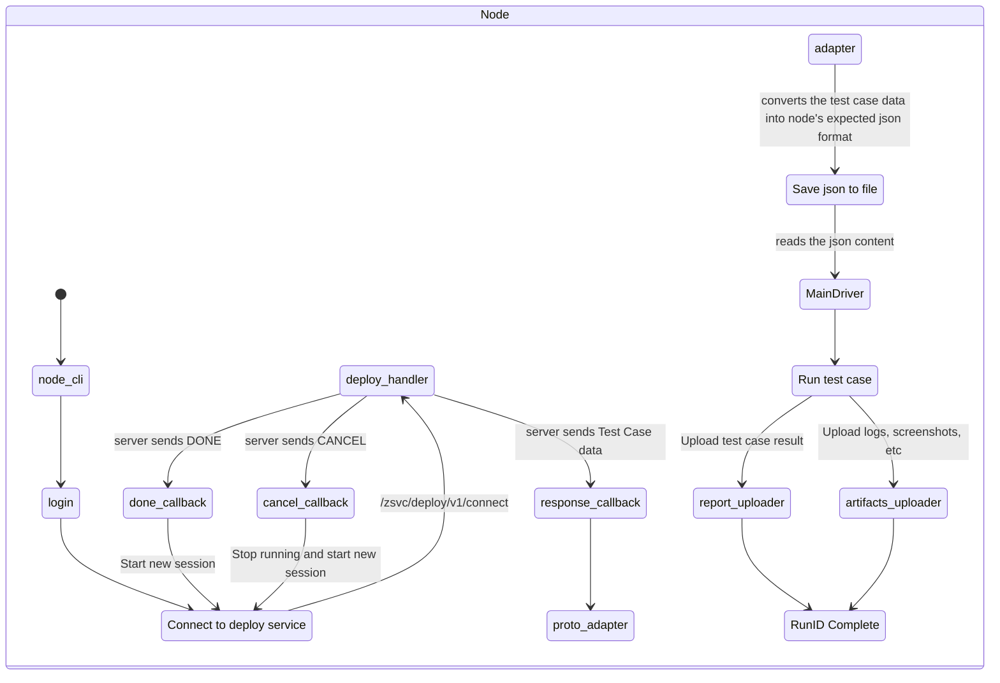

# Zeuz Node

## Download

[Releases](https://github.com/AutomationSolutionz/Zeuz_Python_Node/releases) -
From the latest relase, expand the *Assets* section and click on **Source code
(zip)** to download.

## Description

Client side application for running automated tests.

For help and available flags, run: `python node_cli.py --help`

To run Zeuz Node in daemon mode (as a background process), execute the
`daemon.sh` script.

## FAQ

**Q.** I have Python 3.9+ installed. Can I use ZeuZ Node with it?
> Our recommended Python version at the moment is Python 3.8. We have tested all
> the internal modules with this version. However, if you are not doing
> **Windows** automation, it should be fine to run any newer versions of Python.

**Q.** How do I logout?
> Run `python node_cli.py --logout`

**Q.** My webdrivers are not downloading because of SSL certificate verification
   issues.
> Set the `WDM_SSL_VERIFY=0` environment variable, relaunch your terminal and
> run node_cli.py again.

## State diagram

